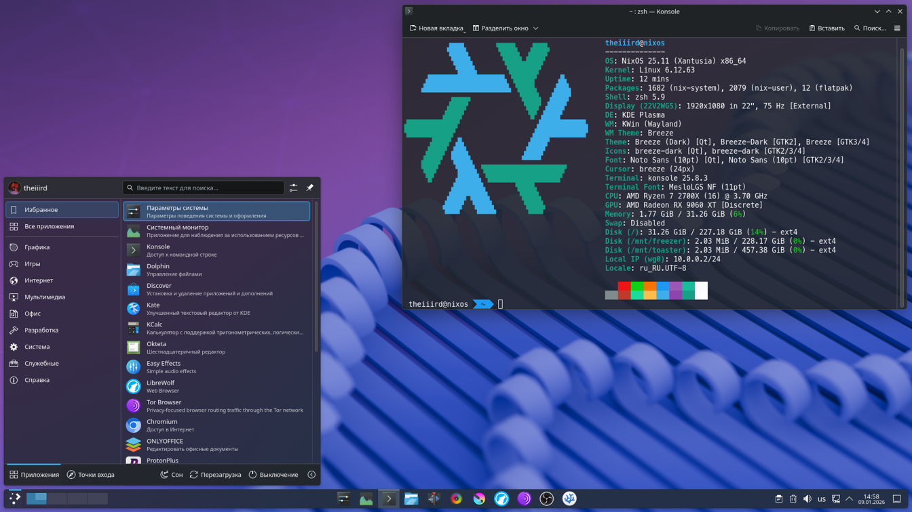

# ❄️ NixOS Workstation

Modern NixOS configuration focused on productivity and aesthetics. Perfect for developers and power users.



## ✨ Key Features
- 🖥️ **Multi-Host Support** - Configure multiple machines from one codebase
- 🏠 **Home Manager Integration** - Unified user environment management
- ⌨️ **Terminal Productivity** - Optimized Zsh with pre-installed plugins
- 🌟 **Visual Consistency** - Pre-configured themes and desktop environments

## 🚀 Getting Started

### Prerequisites
- NixOS installed ([official guide](https://nixos.org/manual/nixos/stable/#sec-installation))

### Quick Setup
```bash
bash <(curl -s https://raw.githubusercontent.com/TheIIIrd/nixos-workstation/refs/heads/main/install.sh)
```

```bash
# After reboot:
bash <(curl -s https://raw.githubusercontent.com/TheIIIrd/nixos-workstation/refs/heads/main/postinstall.sh)
```

### Manual Configuration
1. Clone repository:
   ```bash
   git clone https://github.com/TheIIIrd/nixos-workstation.git ~/.nix
   cd ~/.nix
   ```

2. Create host configuration:
   ```bash
   cd hosts
   cp -r nixos YOUR_HOSTNAME
   cd YOUR_HOSTNAME
   cp /etc/nixos/hardware-configuration.nix .
   ```

3. Update configurations (edit these files):
   - `~/.nix/hosts/YOUR_HOSTNAME/local-packages.nix`
   - `~/.nix/home-manager/home-packages.nix`
   - `~/.nix/nixos/modules/desktop/default.nix`
   - `~/.nix/nixos/modules/graphics/default.nix`

4. Configure zapret (if needed):
   ```bash
   nix-shell -p zapret --command blockcheck
   nano ../../nixos/modules/base/zapret.nix
   ```

5. Update flake.nix:
    ```bash
    sed -i -e 's/theiiird/YOUR_USERNAME/g' \
       -e '/{ hostname = "nixos-blank"; stateVersion = "24.11"; }/d' \
       -e 's/hostname = "nixos"/hostname = "YOUR_HOSTNAME"/' \
       -e 's/stateVersion = "24.11"/stateVersion = "YOUR_NIXOS_VERSION"/' \
       -e 's/homeStateVersion = "24.11";/homeStateVersion = "YOUR_HM_VERSION";/' \
       ~/.nix/flake.nix
    ```

    ```diff
    ...
      outputs = { self, nixpkgs, home-manager, ... }@inputs: let
        system = "x86_64-linux";
    --  homeStateVersion = "24.11";
    ++  homeStateVersion = "YOUR_HM_VERSION";
    --  user = "theiiird";
    ++  user = "YOUR_USERNAME";
        hosts = [
    --    { hostname = "nixos"; stateVersion = "24.11"; }
    --    { hostname = "nixos-blank"; stateVersion = "24.11"; }
    ++    { hostname = "YOUR_HOSTNAME"; stateVersion = "YOUR_NIXOS_VERSION"; }
        ];
    ...
    ```

6. Build system:
   ```bash
   sudo nixos-rebuild boot --flake ./#YOUR_HOSTNAME
   reboot
   ```

### Post-Install Setup
```bash
# Flatpak setup
flatpak remote-add --if-not-exists flathub https://dl.flathub.org/repo/flathub.flatpakrepo
flatpak install org.gtk.Gtk3theme.adw-gtk3 org.gtk.Gtk3theme.adw-gtk3-dark

# GNOME keyboard fix
gsettings set org.gnome.desktop.wm.keybindings switch-input-source-backward "['<Alt>Shift_L']"

# Font setup
mkdir -p ~/.local/share/fonts
cp /nix/store/*-corefonts-1/share/fonts/truetype/* ~/.local/share/fonts
```

## 🖼️ More Screenshots
See [screenshots directory](./screenshots) for additional previews.

## 🤝 Contributing
Contributions welcome! Please:
1. Fork the repository
2. Create feature branches (`git checkout -b feature/amazing-feature`)
3. Commit changes (`git commit -m 'Add amazing feature'`)
4. Push to branch (`git push origin feature/amazing-feature`)
5. Open a Pull Request

